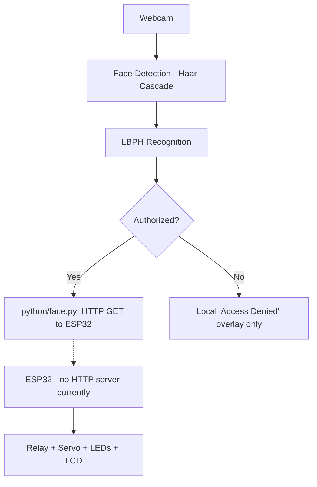

# Smart Door Unlocking System Using Face Recognition

An ESP32-based smart door access system that uses real-time face
recognition (OpenCV + LBPH) on a PC to decide whether to unlock a
door, and an ESP32 to drive the physical lock hardware — servo motor,
relay, status LEDs and an I2C LCD.

> **MPCA Mini Project — 4th Semester, PES University**

## Overview

The Python side captures face images, trains an LBPH
(Local Binary Patterns Histograms) face recognizer, and runs real-time
recognition on a webcam feed. The ESP32 side independently manages an
IR sensor, an LCD status display, LEDs, a relay, and a servo, and
listens for `OPEN` / `DENIED` commands to unlock or keep the door
locked.

**Please read the [Known Issues](#known-issues) section below before
assuming the two halves work together out of the box** — the
integration between the Python recognizer and the ESP32 firmware has a
verified gap that you'll need to close first.

## Features

Confirmed in the actual source code:

- Real-time face detection via Haar cascade (`haarcascade_frontalface_default.xml`)
- LBPH-based face recognition with a configurable confidence threshold
- Face dataset collection tool (`python/dataset.py`)
- Model training script (`python/trainer.py`)
- ESP32 firmware that:
  - Displays live status ("System Ready", "Object Detected", "No Object") on a 16x2 I2C LCD
  - Reports IR sensor presence detection
  - Unlocks (servo to 90° + relay + green LED) on an `OPEN` serial command, then automatically re-locks after 5 seconds
  - Denies access (red LED + LCD message) on a `DENIED` serial command

Not confirmed / not implemented — see [Known Issues](#known-issues):

- End-to-end HTTP communication between the PC and the ESP32
- The Python script sending a `DENIED` signal to the ESP32

## System Architecture



Full data-flow details and the verified Serial-vs-HTTP discrepancy are
documented in [`docs/architecture.md`](docs/architecture.md).

## Hardware Components

| Component            | Purpose                                   |
|-----------------------|--------------------------------------------|
| ESP32                 | Main hardware controller                  |
| IR Sensor             | Object/person detection                   |
| Servo Motor           | Door movement                             |
| Relay Module (5V)     | Door lock control                         |
| 16x2 I2C LCD          | Status display                            |
| RGB / discrete LEDs   | Access status (red = denied, green = granted) |
| Laptop / Camera       | Face capture and recognition              |
| Breadboard, jumper wires | Prototyping                            |

See [`docs/hardware.md`](docs/hardware.md) for wiring details.

## Pin Configuration

Verified against `arduino/smart_door_esp32/smart_door_esp32.ino`:

| Component | ESP32 GPIO |
|-----------|-----------:|
| IR Sensor |         13 |
| Red LED   |         25 |
| Green LED |         26 |
| Relay     |         27 |
| Servo     |         14 |
| I2C SDA   |         21 |
| I2C SCL   |         22 |

LCD I2C address: `0x27`.

> Note: the circuit diagram in the original project report shows a
> different mapping for two pins (IR sensor, green LED). The table
> above reflects what the firmware actually uses — see
> [`docs/hardware.md`](docs/hardware.md) for details.

## Software Requirements

- Python 3.x
- Arduino IDE with ESP32 board support
- Python packages (see [`requirements.txt`](requirements.txt)):
  `opencv-contrib-python`, `numpy`, `Pillow`, `requests`
- Arduino libraries: `Wire` (bundled), `LiquidCrystal_I2C`, `ESP32Servo`

Exact versions used during original development were not recorded, so
none are pinned — install current versions compatible with your
Python/Arduino IDE setup.

## Installation & Running

Full step-by-step instructions (Python env, Arduino IDE/board setup,
exact commands) are in [`docs/setup.md`](docs/setup.md). Quick summary:

```bash
git clone <YOUR_REPO_URL>
cd Smart-Door-Unlocking-System/python
pip install -r ../requirements.txt

python dataset.py   # collect ~30 face images for a numeric user ID
python trainer.py   # train LBPH model -> trainer.yml
python face.py      # run real-time recognition
```

Then, separately, upload `arduino/smart_door_esp32/smart_door_esp32.ino`
to your ESP32 via the Arduino IDE.

## Commands / Communication Protocol

The ESP32 firmware listens on Serial for two literal command strings:

| Command  | ESP32 behavior                                                                 |
|----------|----------------------------------------------------------------------------------|
| `OPEN`   | LCD → "Door Unlocked", green LED on, relay energized, servo → 90°, waits 5s, then reverses everything and LCD → "System Ready" |
| `DENIED` | LCD → "Access Denied", red LED on for 2s, then LCD → "Try Again" → "System Ready" |

`python/face.py`, however, does not currently send these strings over
Serial — it sends an HTTP GET to `http://192.168.4.1/unlock` on an
authorized face, and sends nothing at all on a denied face. See
[Known Issues](#known-issues).

## Project Workflow

1. System initialization (ESP32 boots, LCD/servo/relay/LEDs set to idle state)
2. Face dataset collection (`dataset.py`)
3. Model training (`trainer.py`)
4. Real-time face detection (`face.py`)
5. LBPH recognition + confidence check
6. Access decision (authorized / unauthorized)
7. Attempted communication with ESP32 (see protocol gap above)
8. Door unlock / access denial on the ESP32 side
9. Automatic return to locked / "System Ready" state

## Output / Status Messages

Confirmed messages actually present in the code:

- `System Ready` (ESP32 LCD, idle state)
- `Object Detected` / `No Object` (ESP32 LCD, from IR sensor)
- `Door Unlocked` (ESP32 LCD, on `OPEN`)
- `Access Denied` / `Try Again` (ESP32 LCD, on `DENIED`)
- `Access Granted` / `Access Denied` / `No Face Detected` (on-screen OpenCV overlay in `face.py`)

## Known Issues

1. **HTTP vs Serial mismatch (verified):** `python/face.py` sends an
   HTTP GET to `http://192.168.4.1/unlock`; the ESP32 firmware has no
   Wi-Fi/HTTP server and only listens on Serial for `OPEN`/`DENIED`.
   As shipped, an authorized recognition will not currently reach the
   ESP32. See [`docs/architecture.md`](docs/architecture.md) for two
   ways to close this gap.
2. **`DENIED` is never sent:** `face.py` only shows "Access Denied"
   locally in the OpenCV window; it never notifies the ESP32, so the
   firmware's fully-implemented `DENIED` branch (red LED, LCD message)
   is currently unreachable from the Python side.
3. **Blocking `delay()` calls in the ESP32 sketch:** the 5-second door
   window and 2-second denied indicator use blocking `delay()` calls,
   during which the IR sensor and Serial input are not serviced. This
   matches the original working behavior and was left unchanged, but
   is worth knowing about if you extend the firmware.
4. **Pin mapping mismatch with the report's circuit diagram:** the
   report's circuit diagram shows the IR sensor on D12 and the green
   LED on D33; the firmware actually uses GPIO 13 and GPIO 26
   respectively. Wire to the pins in this README/`.ino`, not the
   diagram image, if in doubt.

## Security & Privacy

This project handles face images (biometric data). This repository
**intentionally excludes**:

- Captured face images (`python/dataset/`)
- The trained model (`python/trainer.yml`), since it's derived from
  the biometric dataset and is regenerated by `trainer.py`
- Any Wi-Fi credentials, API keys, or `.env` files

If you need to share a demo dataset/model for grading purposes, do so
privately (e.g. a private cloud folder shared directly with your
evaluator) rather than committing it to a public repository.

## Troubleshooting

| Symptom | Likely cause / fix |
|---|---|
| ESP32 not detected in Arduino IDE | Check USB cable (data-capable, not charge-only), install CP210x/CH340 USB drivers, try a different port |
| Upload fails / wrong COM port | Re-check **Tools → Port** after plugging in; close any Serial Monitor window before uploading |
| LCD shows nothing / garbled text | Confirm I2C address (try an I2C scanner sketch — common alternates are `0x27` and `0x3F`), check SDA/SCL wiring to GPIO21/22 |
| Servo doesn't move | Check 5V power (don't power from ESP32 3.3V pin), confirm signal wire on GPIO14 |
| Relay clicks but door doesn't lock/unlock | Confirm relay logic — this module is active-LOW (`LOW` = energized) |
| Camera won't open (`test_cam.py`/`face.py`) | Another app may be using the webcam; try a different camera index in `cv2.VideoCapture(i)` |
| `trainer.yml not found` error in `face.py` | Run `python trainer.py` first, from inside `python/` |
| No face detected during training/recognition | Improve lighting, face the camera directly, confirm `haarcascade_frontalface_default.xml` is present |
| `ModuleNotFoundError` for `cv2.face` | Install `opencv-contrib-python`, not the plain `opencv-python` package (they conflict — uninstall both, then reinstall only `opencv-contrib-python`) |
| Recognized face still gets "Access Denied" | Try lowering/raising `CONFIDENCE_THRESHOLD` in `face.py` (lower = stricter) |
| ESP32 never reacts to an authorized face | See **Known Issues #1** — the HTTP/Serial protocol mismatch |

## Project Team

- Harsha R
- Gonu Guntla Hemakowshik
- Gayathri Priya V

*MPCA Mini Project, 4th Semester, PES University.*

## License

This project is licensed under the [MIT License](LICENSE).
