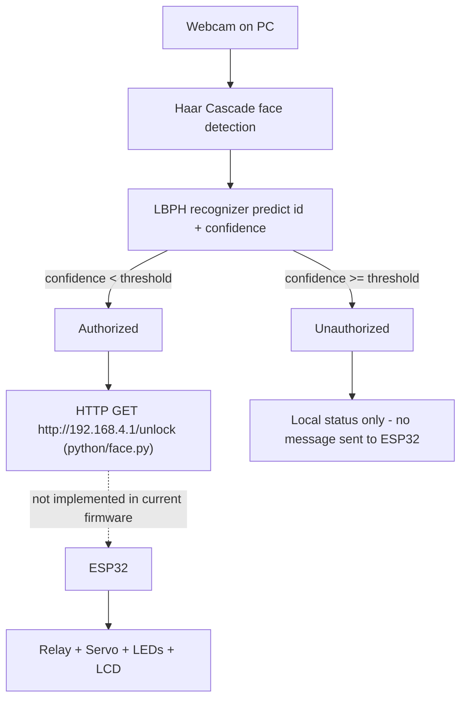

# System Architecture

## Data flow (as implemented in code)

## Component-by-component

1. **`python/dataset.py`** – opens the webcam, runs Haar-cascade face
   detection, and saves cropped grayscale face images to
   `python/dataset/User.<id>.<n>.jpg` for a given numeric user ID
   (30 images per run, capped by `count >= 30` or Esc key).
2. **`python/trainer.py`** – loads every image in `python/dataset/`,
   re-detects the face in each, and trains an OpenCV LBPH
   (`cv2.face.LBPHFaceRecognizer_create`) model, saving it to
   `python/trainer.yml`.
3. **`python/face.py`** – loads `trainer.yml`, opens the webcam, detects
   faces frame-by-frame, and calls `recognizer.predict()` to get an ID
   and a confidence score. If confidence is below the threshold (60),
   the face is treated as authorized.
4. **ESP32 firmware (`arduino/smart_door_esp32/smart_door_esp32.ino`)** –
   independently reads the IR sensor for local LCD status, and listens
   on **Serial** for the text commands `OPEN` and `DENIED`, driving the
   servo, relay and LEDs accordingly.

## Communication protocol — history and current fix

The original project report states that "a signal is sent to ESP32 via
HTTP." When this repository was first assembled, that was only half
true: `python/face.py` sent an HTTP GET to `http://192.168.4.1/unlock`,
but the ESP32 sketch had no Wi-Fi or HTTP server at all — only a Serial
command parser. The two halves did not talk to each other.

**This has been fixed.** The ESP32 sketch now:

- Starts its own Wi-Fi access point (`AP_SSID` / `AP_PASSWORD` defined
  near the top of the `.ino` file), always reachable at the fixed
  address `192.168.4.1` (the ESP32's default softAP address).
- Runs a small HTTP server (`WebServer.h`, bundled with the ESP32
  Arduino core — no extra library install needed) exposing:
  - `GET /unlock` → runs the same unlock sequence as the `OPEN` Serial command
  - `GET /deny` → runs the same deny sequence as the `DENIED` Serial command
- Still also accepts `OPEN` / `DENIED` over Serial, for manual testing
  via the Serial Monitor. Both entry points call the same `doOpen()` /
  `doDeny()` functions, so there is only one implementation of the
  actual door behavior to keep in sync.

`python/face.py` now also calls `GET /deny` when a face is
unauthorized (previously it only updated the local OpenCV overlay and
never notified the ESP32 at all).

**Operationally, this means:** the computer running `face.py` must be
connected to the ESP32's Wi-Fi network (`SmartDoorESP32` by default)
before running the script, since `192.168.4.1` is only reachable over
that network — see [`docs/setup.md`](setup.md). If you'd rather have
the ESP32 join your home Wi-Fi instead of hosting its own network,
that's a further change (station mode + a way to discover its IP,
e.g. mDNS) not included here, since it changes the fixed-IP assumption
baked into `face.py`.
