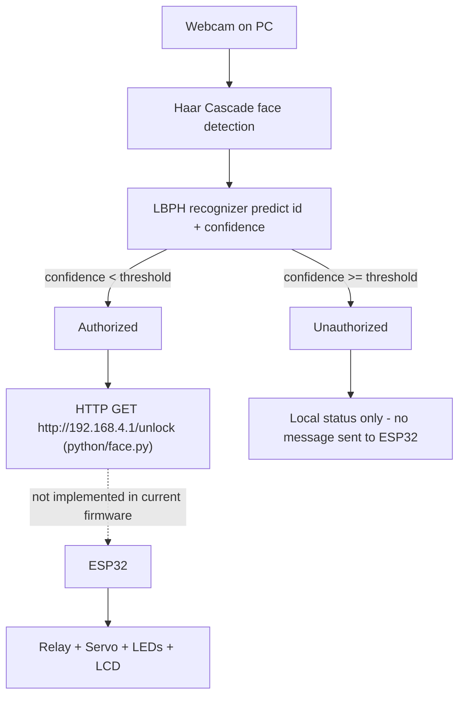

# System Architecture

## Data flow (as implemented in code)

## Component-by-component

1. **`python/dataset.py`** – opens the webcam, runs Haar-cascade face
   detection, and saves cropped grayscale face images to
   `python/dataset/User.<id>.<n>.jpg` for a given numeric user ID
   (30 images per run, capped by `count >= 30` or Esc key).
2. **`python/trainer.py`** – loads every image in `python/dataset/`,
   re-detects the face in each, and trains an OpenCV LBPH
   (`cv2.face.LBPHFaceRecognizer_create`) model, saving it to
   `python/trainer.yml`.
3. **`python/face.py`** – loads `trainer.yml`, opens the webcam, detects
   faces frame-by-frame, and calls `recognizer.predict()` to get an ID
   and a confidence score. If confidence is below the threshold (60),
   the face is treated as authorized.
4. **ESP32 firmware (`arduino/smart_door_esp32/smart_door_esp32.ino`)** –
   independently reads the IR sensor for local LCD status, and listens
   on **Serial** for the text commands `OPEN` and `DENIED`, driving the
   servo, relay and LEDs accordingly.

## Communication protocol — verified discrepancy

The original project report states that "a signal is sent to ESP32 via
HTTP." Checking the actual source code shows this is only half true,
and the two halves of the project do not currently agree with each
other:

- **`python/face.py`** sends an **HTTP GET** request to
  `http://192.168.4.1/unlock` when a face is authorized
  (using the `requests` library). This matches the report's claim of HTTP.
- **`arduino/smart_door_esp32/smart_door_esp32.ino`** contains **no
  Wi-Fi and no HTTP server code at all**. It only reads commands from
  the USB **Serial** connection (`Serial.readStringUntil('\n')`),
  expecting the literal strings `"OPEN"` or `"DENIED"`.

**Practical implication:** as uploaded, running `face.py` will attempt
an HTTP request that the current ESP32 firmware has no way to receive
(there is no access point or web server running on the board). For the
system to work end-to-end, one side needs to change — for example:

- Add a minimal Wi-Fi AP + HTTP server to the `.ino` sketch that
  exposes a `/unlock` route (matching what `face.py` already expects), **or**
- Change `python/face.py` to send `"OPEN"` / `"DENIED"` strings over a
  Serial connection (e.g. via `pyserial`) instead of an HTTP request,
  matching what the `.ino` sketch already expects.

This repository ships both pieces exactly as found, and does **not**
invent a bridge between them — see the README's "Known Issues" section.

Separately, **`face.py` never sends a `"DENIED"` message anywhere** —
on an unauthorized face it only updates the on-screen OpenCV overlay
text locally. The ESP32's `DENIED` branch (red LED, "Access Denied" on
LCD) is fully implemented in firmware but is not currently triggered by
the Python script.
